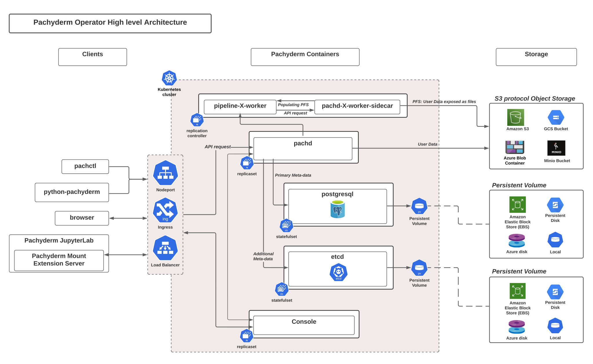

---
# metadata # 
title: Deploy & Manage
description:  Learn how to deploy and manage {} either locally, on-prem, or in the cloud.
date: 
# taxonomy #
tags: 
series:
seriesPart:
weight: 4
---

This section describes how to deploy {} in a production environment.
Additionally, you will find information about basic {} operations,
including upgrading to minor and major versions, autoscaling...

Before you start... The following high-level architecture diagram lays out {}'s main components. It might help you build a quick mental model of {}.

{}
We are now shipping {} with an **embedded proxy** 
allowing your cluster to expose one single port externally. This deployment setup is optional.

If you choose to deploy {} with a Proxy, check out our new recommended architecture and [deployment instructions](../deploy-manage/deploy/deploy-w-proxy/). 
{}
 