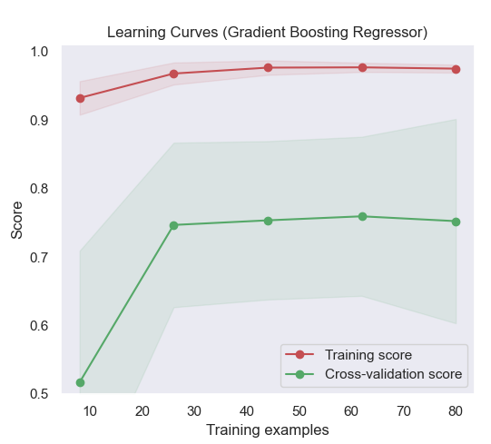
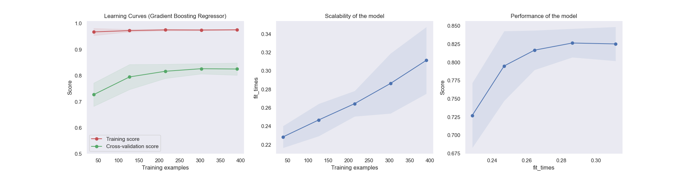

---
# metadata # 
title: Standard ML Pipeline
description: Learn how to build a basic machine learning pipeline.
date: 
# taxonomy #
tags: ["integrations", "automl", "mljar"]
series:
seriesPart:
weight: 1
beta: false 
---

In this tutorial, we'll build a simple machine learning pipeline in {} to train a regression model on housing market data to predict the value of homes in Boston. 
## Before You Start

- You must have a {} cluster up and running
- You should have some basic familiarity with {} [pipeline specs](/{}/build-dags/pipeline-spec) -- see the [Transform](/{}/build-dags/pipeline-spec/transform) and [PFS Input](/{}/build-dags/pipeline-spec/input-pfs) sections in particular
## Tutorial

Our Docker image's [user code](/{}/learn/glossary/user-code) for this tutorial is built on top of the [civisanalytics/datascience-python](https://github.com/civisanalytics/datascience-python) base image, which includes the necessary dependencies.  It uses [pandas](https://pypi.org/project/pandas/) to import the structured dataset and the [scikit-learn](https://scikit-learn.org/stable/) library to train the model. 

### 1. Create a Project & Input Repo

1. Create a project named `standard-ml-tutorial`. 
   ```s
   pachctl create project standard-ml-tutorial
   ```
2. Set the project as current. 
   ```s
   pachctl config update context --project standard-ml-tutorial
   ```
3. Create a repo named `housing_data`.
   ```s
   pachctl create repo housing_data
   ```

### 2. Create a Regression Pipeline

1. Create a file named `regression.json` with the following contents:
   ```json
   # regression.json
   {
       "pipeline": {
           "name": "regression"
       },
       "description": "A pipeline that trains produces a regression model for housing prices.",
       "input": {
           "pfs": {
               "glob": "/*",
               "repo": "housing_data"
           }
       },
       "transform": {
           "cmd": [
               "python", "regression.py",
               "--input", "/pfs/housing_data/",
               "--target-col", "MEDV",
               "--output", "/pfs/out/"
           ],
           "image": "pachyderm/housing-prices:1.11.0"
       }
   }
   ```
2. Save the file.
3. Run the following command to create the pipeline:

   ```s
   pachctl create pipeline -f regression.json
   ```

{}
The pipeline writes the output to a PFS repo (`/pfs/out/`) created with the same name as the pipeline.
{}

### 3. Upload the Housing Dataset

1. Download our first example data set, [housing-simplified-1.csv](./data/housing-simplified-1.csv). 
2. Add the data to your repo. Processing begins automatically --- anytime you add new data, the pipeline will re-run.

   ```s
   pachctl put file housing_data@master:housing-simplified.csv -f /path/to/housing-simplified-1.csv
   ```
3. Verify that the data is in the repository.

   ```s
   pachctl list file housing_data@master

   # NAME                    TYPE SIZE     
   # /housing-simplified.csv file 2.482KiB
   ```

4. Verify that the pipeline is running by looking at the status of the job(s). 

   ```s
   pachctl list job

   # ID                               SUBJOBS PROGRESS CREATED            MODIFIED
   # e7dd14d201a64edc8bf61beed6085ae0 1       ▇▇▇▇▇▇▇▇ 48 seconds ago     48 seconds ago     
   # df117068124643299d46530859851a4b 1       ▇▇▇▇▇▇▇▇ About a minute ago About a minute ago 
   ```

### 4. Download Output Files
Once the pipeline is completed, we can download the files that were created.

1. View a list of the files in the output repo.
   ```s
   pachctl list file regression@master

   # NAME                                  TYPE SIZE     
   # /housing-simplified_corr_matrix.png   file 18.66KiB 
   # /housing-simplified_cv_reg_output.png file 86.07KiB 
   # /housing-simplified_model.sav         file 798.5KiB 
   # /housing-simplified_pairplot.png      file 100.8KiB 
   ```
2. Download the files.
   ```s
   pachctl get file regression@master:/ --recursive --output .
   ```

When we inspect the learning curve, we can see that there is a large gap between the training score and the validation score. This typically indicates that our model could benefit from the addition of more data. 

<p align="center">
  
</p>

Now let's update our dataset with additional examples.

### 5. Update the Dataset

1. Download our second example data set, [housing-simplified-2.csv](./data/housing-simplified-2.csv).
2. Add the data to your repo.

   ```s
   pachctl put file housing_data@master:housing-simplified.csv -f /path/to/housing-simplified-2.csv
   ```

{}
We could also append new examples to the existing file, but in this tutorial we're overwriting our previous file to one with more data.
{}

This is where {} truly starts to shine. The new commit of data to the `housing_data` repository automatically kicks off a job on the `regression` pipeline without us having to do anything. 

When the job is complete we can download the new files and see that our model has improved, given the new learning curve.
<p align="center">
  
</p>

### 6. Inspect the Pipeline Lineage

Since the pipeline versions all of our input and output data automatically, we can continue to iterate on our data and code while {} tracks all of our experiments. 

For any given output commit, {} can tell us exactly which input commit of data was run. In this tutorial, we have only run 2 experiments so far, but this becomes incredibly valuable as your experiments continue to evolve and scale.

1. Inspect the commits to your repo.

   ```s
   pachctl list commit

   # ID                               SUBCOMMITS PROGRESS CREATED            MODIFIED
   # 3037785cc56c4387bbb897f1887b4a68 4          ▇▇▇▇▇▇▇▇ 11 seconds ago     11 seconds ago     
   # e7dd14d201a64edc8bf61beed6085ae0 4          ▇▇▇▇▇▇▇▇ About a minute ago About a minute ago 
   # df117068124643299d46530859851a4b 4          ▇▇▇▇▇▇▇▇ 2 minutes ago      2 minutes ago      
   ```
2. Use the commit ID to check for what dataset was used to create the model.
   ```s
   pachctl list file housing_data@3037785cc56c4387bbb897f1887b4a68

   # NAME                    TYPE SIZE     
   # /housing-simplified.csv file 12.14KiB 
   ```
3. Use the commit ID to check the commit's details (such as parent commit, branch, size, etc.)
     ```s
      pachctl inspect commit housing_data@3037785cc56c4387bbb897f1887b4a68

      # Commit: housing_data@3037785cc56c4387bbb897f1887b4a68
      # Original Branch: master
      # Parent: e7dd14d201a64edc8bf61beed6085ae0
      # Started: 2 minutes ago
      # Finished: 2 minutes ago
      # Size: 12.14KiB
     ```

---

## User Code Assets 

The [Docker image](/{}/build-dags/tutorials/user-code) used in this tutorial was built with the following assets:



{}
{}
{}
{}
{}

{}
{}
```s
FROM civisanalytics/datascience-python
RUN pip install seaborn

WORKDIR /workdir/
COPY *.py /workdir/
```
{}

{}
```s
import argparse
import os
from os import path
import numpy as np
import pandas as pd
import matplotlib.pyplot as plt
import seaborn as sns
import joblib
from utils import plot_learning_curve
import subprocess

from sklearn.model_selection import ShuffleSplit
from sklearn import datasets, ensemble, linear_model
from sklearn.model_selection import learning_curve
from sklearn.model_selection import ShuffleSplit
from sklearn.model_selection import cross_val_score

parser = argparse.ArgumentParser(description="Structured data regression")
parser.add_argument("--input",
                    type=str,
                    help="csv file with all examples")
parser.add_argument("--target-col",
                    type=str,
                    help="column with target values")
parser.add_argument("--output",
                    metavar="DIR",
                    default='./output',
                    help="output directory")

def load_data(input_csv, target_col):
    # Load the Boston housing dataset
    data = pd.read_csv(input_csv, header=0)
    targets = data[target_col]
    features = data.drop(target_col, axis = 1)
    print("Dataset has {} data points with {} variables each.".format(*data.shape))
    return data, features, targets

def create_pairplot(data):
    plt.clf()
    # Calculate and show pairplot
    sns.pairplot(data, height=2.5)
    plt.tight_layout()

def create_corr_matrix(data):
    plt.clf()
    # Calculate and show correlation matrix
    sns.set()
    corr = data.corr()
    
    # Generate a mask for the upper triangle
    mask = np.triu(np.ones_like(corr, dtype=np.bool))

    # Generate a custom diverging colormap
    cmap = sns.diverging_palette(220, 10, as_cmap=True)

    # Draw the heatmap with the mask and correct aspect ratio
    sns_plot = sns.heatmap(corr, mask=mask, cmap=cmap, vmax=.3, center=0,
                square=True, linewidths=.5, annot=True, cbar_kws={"shrink": .5})

def train_model(features, targets):
    # Train a Random Forest Regression model
    reg = ensemble.RandomForestRegressor(random_state=1)
    scores = cross_val_score(reg, features, targets, cv=10)
    print("Score: {:2f} (+/- {:2f})".format(scores.mean(), scores.std() * 2))
    reg.fit(features,targets)
    return reg

def create_learning_curve(estimator, features, targets):
    plt.clf()

    title = "Learning Curves (Random Forest Regressor)"
    cv = ShuffleSplit(n_splits=10, test_size=0.2, random_state=0)
    plot_learning_curve(estimator, title, features, targets, 
                        ylim=(0.5, 1.01), cv=cv, n_jobs=4)

def main():

    print("User code is starting")
    subprocess.run(["pachctl", "connect", "grpc://localhost:1650"])

    print("starting while loop")
    while True:
        subprocess.run(["pachctl", "next", "datum"])
        print("next datum called")

        args = parser.parse_args() 
        if os.path.isfile(args.input):
            input_files = [args.input]
        else:  # Directory
            for dirpath, dirs, files in os.walk(args.input):  
                input_files = [ os.path.join(dirpath, filename) for filename in files if filename.endswith('.csv') ]
        print("Datasets: {}".format(input_files))
        os.makedirs(args.output, exist_ok=True)

        for filename in input_files:

            experiment_name = os.path.basename(os.path.splitext(filename)[0])
            # Data loading and Exploration
            data, features, targets = load_data(filename, args.target_col)
            create_pairplot(data)
            plt.savefig(path.join(args.output,experiment_name + '_pairplot.png'))
            create_corr_matrix(data)
            plt.savefig(path.join(args.output, experiment_name + '_corr_matrix.png'))

            # Fit model
            reg = train_model(features, targets)
            create_learning_curve(reg, features, targets)
            plt.savefig(path.join(args.output, experiment_name + '_cv_reg_output.png'))

            # Save model
            joblib.dump(reg, path.join(args.output,experiment_name + '_model.sav'))

if __name__ == "__main__":
    main()
```
{}
{}
```s
import numpy as np
import matplotlib.pyplot as plt
from sklearn.naive_bayes import GaussianNB
from sklearn.svm import SVC
from sklearn.datasets import load_digits
from sklearn.model_selection import learning_curve
from sklearn.model_selection import ShuffleSplit


def plot_learning_curve(estimator, title, X, y, axes=None, ylim=None, cv=None,
                        n_jobs=None, train_sizes=np.linspace(.1, 1.0, 5)):
    """
    Generate 3 plots: the test and training learning curve, the training
    samples vs fit times curve, the fit times vs score curve.

    Parameters
    ----------
    estimator : object type that implements the "fit" and "predict" methods
        An object of that type which is cloned for each validation.

    title : string
        Title for the chart.

    X : array-like, shape (n_samples, n_features)
        Training vector, where n_samples is the number of samples and
        n_features is the number of features.

    y : array-like, shape (n_samples) or (n_samples, n_features), optional
        Target relative to X for classification or regression;
        None for unsupervised learning.

    axes : array of 3 axes, optional (default=None)
        Axes to use for plotting the curves.

    ylim : tuple, shape (ymin, ymax), optional
        Defines minimum and maximum yvalues plotted.

    cv : int, cross-validation generator or an iterable, optional
        Determines the cross-validation splitting strategy.
        Possible inputs for cv are:

          - None, to use the default 5-fold cross-validation,
          - integer, to specify the number of folds.
          - :term:`CV splitter`,
          - An iterable yielding (train, test) splits as arrays of indices.

        For integer/None inputs, if ``y`` is binary or multiclass,
        :class:`StratifiedKFold` used. If the estimator is not a classifier
        or if ``y`` is neither binary nor multiclass, :class:`KFold` is used.

        Refer :ref:`User Guide <cross_validation>` for the various
        cross-validators that can be used here.

    n_jobs : int or None, optional (default=None)
        Number of jobs to run in parallel.
        ``None`` means 1 unless in a :obj:`joblib.parallel_backend` context.
        ``-1`` means using all processors. See :term:`Glossary <n_jobs>`
        for more details.

    train_sizes : array-like, shape (n_ticks,), dtype float or int
        Relative or absolute numbers of training examples that will be used to
        generate the learning curve. If the dtype is float, it is regarded as a
        fraction of the maximum size of the training set (that is determined
        by the selected validation method), i.e. it has to be within (0, 1].
        Otherwise it is interpreted as absolute sizes of the training sets.
        Note that for classification the number of samples usually have to
        be big enough to contain at least one sample from each class.
        (default: np.linspace(0.1, 1.0, 5))
    """
    if axes is None:
        _, axes = plt.subplots(1, 3, figsize=(20, 5))

    axes[0].set_title(title)
    if ylim is not None:
        axes[0].set_ylim(*ylim)
    axes[0].set_xlabel("Training examples")
    axes[0].set_ylabel("Score")

    train_sizes, train_scores, test_scores, fit_times, _ = \
        learning_curve(estimator, X, y, cv=cv, n_jobs=n_jobs,
                       train_sizes=train_sizes,
                       return_times=True)
    train_scores_mean = np.mean(train_scores, axis=1)
    train_scores_std = np.std(train_scores, axis=1)
    test_scores_mean = np.mean(test_scores, axis=1)
    test_scores_std = np.std(test_scores, axis=1)
    fit_times_mean = np.mean(fit_times, axis=1)
    fit_times_std = np.std(fit_times, axis=1)

    # Plot learning curve
    axes[0].grid()
    axes[0].fill_between(train_sizes, train_scores_mean - train_scores_std,
                         train_scores_mean + train_scores_std, alpha=0.1,
                         color="r")
    axes[0].fill_between(train_sizes, test_scores_mean - test_scores_std,
                         test_scores_mean + test_scores_std, alpha=0.1,
                         color="g")
    axes[0].plot(train_sizes, train_scores_mean, 'o-', color="r",
                 label="Training score")
    axes[0].plot(train_sizes, test_scores_mean, 'o-', color="g",
                 label="Cross-validation score")
    axes[0].legend(loc="best")

    # Plot n_samples vs fit_times
    axes[1].grid()
    axes[1].plot(train_sizes, fit_times_mean, 'o-')
    axes[1].fill_between(train_sizes, fit_times_mean - fit_times_std,
                         fit_times_mean + fit_times_std, alpha=0.1)
    axes[1].set_xlabel("Training examples")
    axes[1].set_ylabel("fit_times")
    axes[1].set_title("Scalability of the model")

    # Plot fit_time vs score
    axes[2].grid()
    axes[2].plot(fit_times_mean, test_scores_mean, 'o-')
    axes[2].fill_between(fit_times_mean, test_scores_mean - test_scores_std,
                         test_scores_mean + test_scores_std, alpha=0.1)
    axes[2].set_xlabel("fit_times")
    axes[2].set_ylabel("Score")
    axes[2].set_title("Performance of the model")

    return plt
```
{}

{}

