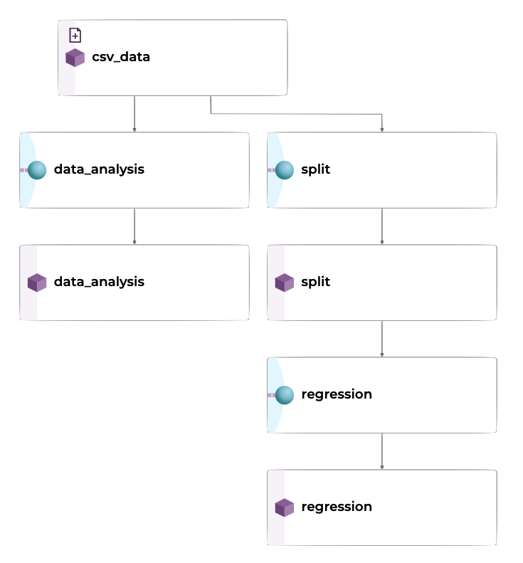
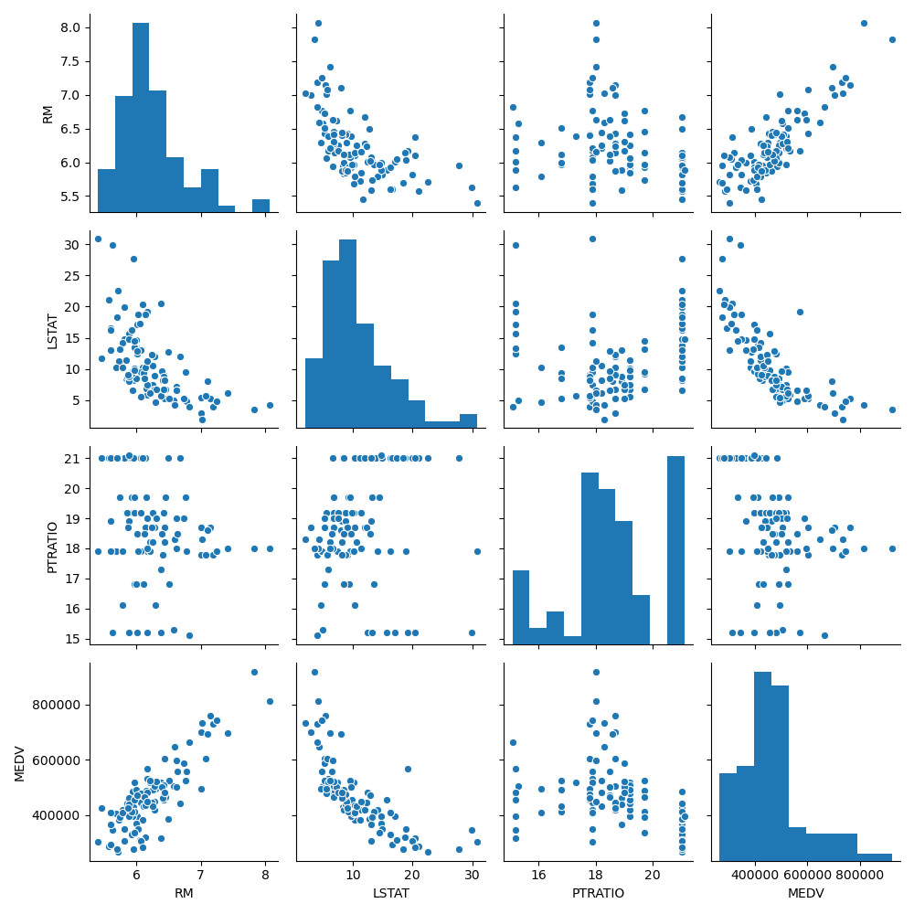
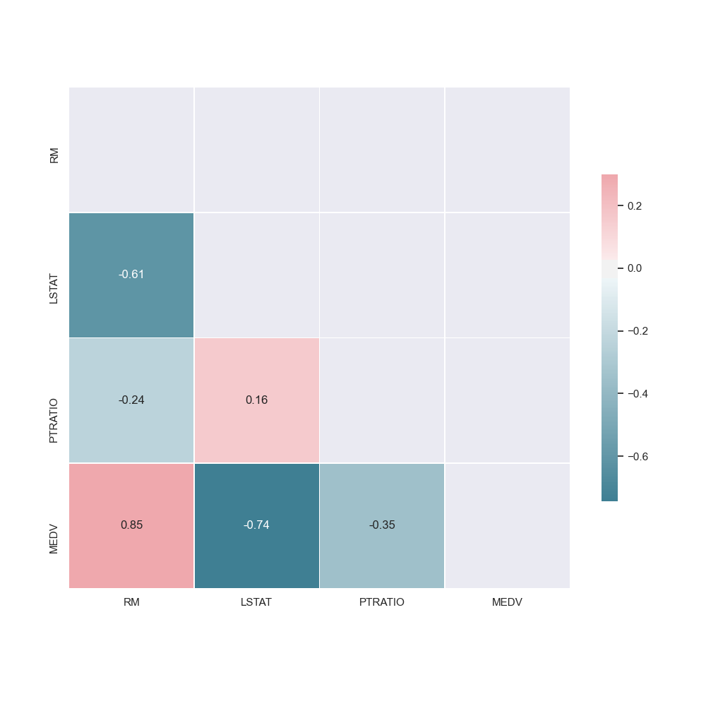
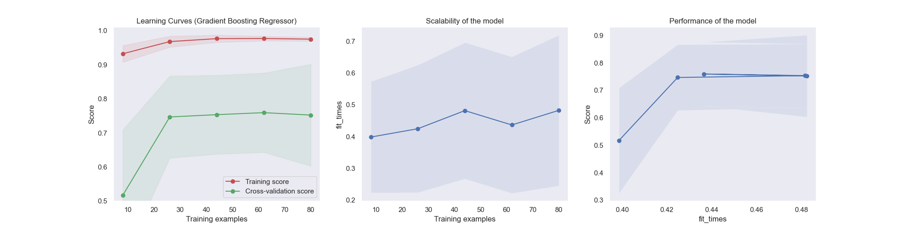

---
# metadata # 
title: Multi-Pipeline DAG
description: Learn how to build a DAG with multiple pipelines.
date: 
# taxonomy #
tags: ["integrations", "automl", "mljar"]
series:
seriesPart:
weight: 2
beta: false 
---

In this tutorial, we'll build a multi-pipeline DAG to train a regression model on housing market data to predict the value of homes in Boston. This tutorial builds on the skills learned from the previous tutorials, ([Standard ML Pipeline](/{}/build-dags/tutorials/basic-ml) and [AutoML Pipeline](/{}/build-dags/tutorials/auto-ml). 

## Before You Start 
- You must have {} installed and running on your cluster
- You should have already completed the [Standard ML Pipeline](/{}/build-dags/tutorials/basic-ml) tutorial
- You must be familiar with jsonnet
- This tutorial assumes your active context is `localhost:80`
  
## Tutorial 

Our Docker image's [user code](/{}/learn/glossary/user-code) for this tutorial is built on top of the [civisanalytics/datascience-python](https://github.com/civisanalytics/datascience-python) base image, which includes the necessary dependencies.  It uses [pandas](https://pypi.org/project/pandas/) to import the structured dataset and the [scikit-learn](https://scikit-learn.org/stable/) library to train the model. 

Each pipeline in this tutorial executes a Python script,  versions the artifacts (datasets, models, etc.), and gives you a full lineage of the model. Once it is set up, you can change, add, or remove data and Pachyderm will automatically keep everything up to date, creating data splits, computing data analysis metrics, and training the model. 

<p align="center">
  
</p>

### 1. Create an Input Repo 

1. Create a project named `multipipeline-tutorial`. 
   ```s
   pachctl create project multipipeline-tutorial
   ```
2. Set the project as current. 
   ```s
   pachctl config update context --project multipipeline-tutorial
   ```
3. Create a new data repository called `csv_data` where we will put our dataset.

   ```s
   pachctl create repo csv_data
   ```
### 2. Create the Pipelines

We'll deploy each stage in our ML process as a Pachyderm pipeline. Organizing our work into pipelines allows us to keep track of artifacts created in our ML development process. We can extend or add pipelines at any point to add new functionality or features, while keeping track of code and data changes simultaneously.

#### 1. Data Analysis Pipeline
The data analysis pipeline creates a pair plot and a correlation matrix showing the relationship between features. By seeing what features are positively or negatively correlated to the target value (or each other), it can helps us understand what features may be valuable to the model.
<p align="center">
  
  
</p>

1. Create a file named `data_analysis.json` with the following contents:
   ```s
   {
    "pipeline": {
        "name": "data_analysis"
    },
    "description": "Data analysis pipeline that creates pairplots and correlation matrices for csv files.",
    "input": {
        "pfs": {
            "glob": "/*",
            "repo": "csv_data"
        }
    },
    "transform": {
        "cmd": [
            "python", "data_analysis.py",
            "--input", "/pfs/csv_data/",
            "--target-col", "MEDV",
            "--output", "/pfs/out/"
        ],
        "image": "jimmywhitaker/housing-prices-int:dev0.2"
    }
   }
   ```
2. Save the file.
3. Create the pipeline.

   ```s
   pachctl create pipeline -f /path/to/data_analysis.json
   ```

#### 2. Split Pipeline
Split the input `csv` files into `train` and `test` sets. As we new data is added, we will always have access to previous versions of the splits to reproduce experiments and test results. 

Both the `split` pipeline and the `data_analysis` pipeline take the `csv_data` as input but have no dependencies on each other. Pachyderm is able to recognize this. It can run each pipeline simultaneously, scaling each horizontally.

1. Create a file named `split.json` with the following contents:
   ```s
   {
    "pipeline": {
        "name": "split"
    },
    "description": "A pipeline that splits tabular data into training and testing sets.",
    "input": {
        "pfs": {
            "glob": "/*",
            "repo": "csv_data"
        }
    },
    "transform": {
        "cmd": [
            "python", "split.py",
            "--input", "/pfs/csv_data/",
            "--test-size", "0.1",
            "--output", "/pfs/out/"
        ],
        "image": "jimmywhitaker/housing-prices-int:dev0.2"
    }
   }
   ```
2. Save the file.
3. Create the pipeline.

   ```s
   pachctl create pipeline -f /path/to/split.json
   ```

#### 3. Regression Pipeline
To train the regression model using scikit-learn. In our case, we will train a Random Forest Regressor ensemble. After splitting the data into features and targets (`X` and `y`), we can fit the model to our parameters. Once the model is trained, we will compute our score (r^2) on the test set. 

After the model is trained we output some visualizations to evaluate its effectiveness of it using the learning curve and other statistics.
<p align="center">
  
</p>

1. Create a file named `regression.json` with the following contents:
   ```s
   {
    "pipeline": {
        "name": "regression"
    },
    "description": "A pipeline that trains and tests a regression model for tabular.",
    "input": {
        "pfs": {
            "glob": "/*/",
            "repo": "split"
        }
    },
    "transform": {
        "cmd": [
            "python", "regression.py",
            "--input", "/pfs/split/",
            "--target-col", "MEDV",
            "--output", "/pfs/out/"
        ],
        "image": "jimmywhitaker/housing-prices-int:dev0.2"
    }
   }
   ```
2. Save the file.
3. Create the pipeline.

   ```s
   pachctl create pipeline -f /path/to/regression.json
   ```

### 3. Upload the Dataset
1. Download our first example data set, [housing-simplified-1.csv](/{}/build-dags/tutorials/multi-ml/data/housing-simplified-1.csv). 
2. Add the data to your repo.
   ```s
   pachctl put file csv_data@master:housing-simplified.csv -f /path/to/housing-simplified-1.csv
   ```
### 4. Download the Results

Once the pipeline has finished, download the results.
   ```s
   pachctl get file regression@master:/ --recursive --output .
   ```

### 5. Update the Dataset

1. Download our second example data set, [housing-simplified-2.csv](/{}/build-dags/tutorials/multi-ml/data/housing-simplified-2.csv). 
2. Add the data to your repo.
   ```s
   pachctl put file csv_data@master:housing-simplified.csv -f /path/to/housing-simplified-2.csv
   ```

### 6. Inspect the Data

We can use the `diff` command and [ancestry syntax](/{}/learn/glossary/ancestry-syntax) to see what has changed between the two versions of the dataset.
   ```s
   pachctl diff file csv_data@master csv_data@master^
   ```

### Bonus Step: Rolling Back

If you need to roll back to a previous dataset commit, you can do so with the `create branch` command and [ancestry syntax](/{}/learn/glossary/ancestry-syntax).
   ```s
   pachctl create branch csv_data@master --head csv_data@master^
   ```

---
## User Code Assets 

The [Docker image](/{}/build-dags/tutorials/user-code) used in this tutorial was built with the following assets:



{}
{}
{}
{}
{}
{}
{}

{}
{}
```Dockerfile
FROM civisanalytics/datascience-python
RUN pip install seaborn

WORKDIR /workdir/
COPY *.py /workdir/
```
{}
{}
```python
import argparse
import os
from os import path
import numpy as np
import pandas as pd
import matplotlib.pyplot as plt
import seaborn as sns
import joblib
from utils import plot_learning_curve

from sklearn.model_selection import ShuffleSplit
from sklearn import datasets, ensemble, linear_model
from sklearn.model_selection import learning_curve
from sklearn.model_selection import ShuffleSplit
from sklearn.model_selection import cross_val_score 
from sklearn.metrics import r2_score

parser = argparse.ArgumentParser(description="Structured data regression")
parser.add_argument("--input",
                    type=str,
                    help="directory with train.csv and test.csv")
parser.add_argument("--target-col",
                    type=str,
                    default="MEDV",
                    help="column with target values")
parser.add_argument("--output",
                    metavar="DIR",
                    default='./output',
                    help="output directory")

def load_data(input_csv, target_col):
    # Load the Boston housing dataset
    data = pd.read_csv(input_csv, header=0)
    targets = data[target_col]
    features = data.drop(target_col, axis = 1)
    return data, features, targets

def train_model(features, targets):
    # Train a Random Forest Regression model
    reg = ensemble.RandomForestRegressor(random_state=1)
    scores = cross_val_score(reg, features, targets, cv=10)
    print("Cross Val Score: {:2f} (+/- {:2f})".format(scores.mean(), scores.std() * 2))
    reg.fit(features,targets)
    
    return reg

def test_model(model, features, targets):
    # Train a Random Forest Regression model
    score = r2_score(model.predict(features), targets)

    return "Test Score: {:2f}".format(score)

def create_learning_curve(estimator, features, targets):
    plt.clf()

    title = "Learning Curves (Random Forest Regressor)"
    cv = ShuffleSplit(n_splits=10, test_size=0.2, random_state=0)
    plot_learning_curve(estimator, title, features, targets, 
                        ylim=(0.5, 1.01), cv=cv, n_jobs=4)

def main():
    args = parser.parse_args()
    input_dirs = []
    file_list = os.listdir(args.input)
    if 'train.csv' in file_list and 'test.csv' in file_list:
        input_dirs = [args.input]
    else:  # Directory of directories
        for root, dirs, files in os.walk(args.input):  
            for dir in dirs: 
                file_list = os.listdir(os.path.join(root, dir))
                if 'train.csv' in file_list and 'test.csv' in file_list:
                    input_dirs.append(os.path.join(root,dir))
    print("Datasets: {}".format(input_dirs))
    os.makedirs(args.output, exist_ok=True)

    for dir in input_dirs:
        experiment_name = os.path.basename(os.path.splitext(dir)[0])
        train_filename = os.path.join(dir,'train.csv')
        test_filename = os.path.join(dir,'test.csv')
        # Data loading 
        train_data, train_features, train_targets = load_data(train_filename, args.target_col)
        print("Training set has {} data points with {} variables each.".format(*train_data.shape))
        test_data, test_features, test_targets = load_data(test_filename, args.target_col)
        print("Testing set has {} data points with {} variables each.".format(*test_data.shape))

        reg = train_model(train_features, train_targets)
        test_results = test_model(reg, test_features, test_targets)
        create_learning_curve(reg, train_features, train_targets)
        plt.savefig(path.join(args.output, experiment_name + '_cv_reg_output.png'))

        print(test_results)

        # Save model and test score
        joblib.dump(reg, path.join(args.output, experiment_name + '_model.sav'))
        with open(path.join(args.output, experiment_name + '_test_results.txt'), "w") as text_file:
            text_file.write(test_results)

if __name__ == "__main__":
    main()
```
{}
{}
```python
import argparse
import os
from os import path
import numpy as np
import pandas as pd
import matplotlib.pyplot as plt
import seaborn as sns
import joblib
from utils import load_data

from sklearn.model_selection import train_test_split

parser = argparse.ArgumentParser(description="Structured data regression")
parser.add_argument("--input",
                    type=str,
                    help="csv file with all examples")
parser.add_argument("--output",
                    metavar="DIR",
                    default='./output',
                    help="output directory")
parser.add_argument("--test-size",
                    type=float,
                    default=0.2,
                    help="percentage of data to use for testing (\"0.2\" = 20% used for testing, 80% for training")
parser.add_argument("--seed",
                    type=int,
                    default=42,
                    help="random seed")

def main():
    args = parser.parse_args()
    if os.path.isfile(args.input):
        input_files = [args.input]
    else:  # Directory
        for dirpath, dirs, files in os.walk(args.input):  
            input_files = [ os.path.join(dirpath, filename) for filename in files if filename.endswith('.csv') ]
    print("Datasets: {}".format(input_files))

    for filename in input_files:
        file_basename = os.path.basename(os.path.splitext(filename)[0])
        os.makedirs(os.path.join(args.output,file_basename), exist_ok=True)
        # Data loading 
        data = load_data(filename)
        train, test = train_test_split(data, test_size=args.test_size, random_state=args.seed)
        

        train.to_csv(os.path.join(args.output, file_basename, 'train.csv'), header=True, index=False)
        test.to_csv(os.path.join(args.output, file_basename, 'test.csv'), header=True, index=False)


if __name__ == "__main__":
    main()
```
{}
{}
```python
import numpy as np
import pandas as pd
import matplotlib.pyplot as plt
from sklearn.naive_bayes import GaussianNB
from sklearn.svm import SVC
from sklearn.datasets import load_digits
from sklearn.model_selection import learning_curve
from sklearn.model_selection import ShuffleSplit

def load_data(input_csv, target_col=None):
    # Load the Boston housing dataset
    data = pd.read_csv(input_csv, header=0)
    if target_col:
        targets = data[target_col]
        features = data.drop(target_col, axis = 1)
        print("Dataset has {} data points with {} variables each.".format(*data.shape))
        return data, features, targets
    return data

def plot_learning_curve(estimator, title, X, y, axes=None, ylim=None, cv=None,
                        n_jobs=None, train_sizes=np.linspace(.1, 1.0, 5)):
    """
    Generate 3 plots: the test and training learning curve, the training
    samples vs fit times curve, the fit times vs score curve.

    Parameters
    ----------
    estimator : object type that implements the "fit" and "predict" methods
        An object of that type which is cloned for each validation.

    title : string
        Title for the chart.

    X : array-like, shape (n_samples, n_features)
        Training vector, where n_samples is the number of samples and
        n_features is the number of features.

    y : array-like, shape (n_samples) or (n_samples, n_features), optional
        Target relative to X for classification or regression;
        None for unsupervised learning.

    axes : array of 3 axes, optional (default=None)
        Axes to use for plotting the curves.

    ylim : tuple, shape (ymin, ymax), optional
        Defines minimum and maximum yvalues plotted.

    cv : int, cross-validation generator or an iterable, optional
        Determines the cross-validation splitting strategy.
        Possible inputs for cv are:

          - None, to use the default 5-fold cross-validation,
          - integer, to specify the number of folds.
          - :term:`CV splitter`,
          - An iterable yielding (train, test) splits as arrays of indices.

        For integer/None inputs, if ``y`` is binary or multiclass,
        :class:`StratifiedKFold` used. If the estimator is not a classifier
        or if ``y`` is neither binary nor multiclass, :class:`KFold` is used.

        Refer :ref:`User Guide <cross_validation>` for the various
        cross-validators that can be used here.

    n_jobs : int or None, optional (default=None)
        Number of jobs to run in parallel.
        ``None`` means 1 unless in a :obj:`joblib.parallel_backend` context.
        ``-1`` means using all processors. See :term:`Glossary <n_jobs>`
        for more details.

    train_sizes : array-like, shape (n_ticks,), dtype float or int
        Relative or absolute numbers of training examples that will be used to
        generate the learning curve. If the dtype is float, it is regarded as a
        fraction of the maximum size of the training set (that is determined
        by the selected validation method), i.e. it has to be within (0, 1].
        Otherwise it is interpreted as absolute sizes of the training sets.
        Note that for classification the number of samples usually have to
        be big enough to contain at least one sample from each class.
        (default: np.linspace(0.1, 1.0, 5))
    """
    if axes is None:
        _, axes = plt.subplots(1, 3, figsize=(20, 5))

    axes[0].set_title(title)
    if ylim is not None:
        axes[0].set_ylim(*ylim)
    axes[0].set_xlabel("Training examples")
    axes[0].set_ylabel("Score")

    train_sizes, train_scores, test_scores, fit_times, _ = \
        learning_curve(estimator, X, y, cv=cv, n_jobs=n_jobs,
                       train_sizes=train_sizes,
                       return_times=True)
    train_scores_mean = np.mean(train_scores, axis=1)
    train_scores_std = np.std(train_scores, axis=1)
    test_scores_mean = np.mean(test_scores, axis=1)
    test_scores_std = np.std(test_scores, axis=1)
    fit_times_mean = np.mean(fit_times, axis=1)
    fit_times_std = np.std(fit_times, axis=1)

    # Plot learning curve
    axes[0].grid()
    axes[0].fill_between(train_sizes, train_scores_mean - train_scores_std,
                         train_scores_mean + train_scores_std, alpha=0.1,
                         color="r")
    axes[0].fill_between(train_sizes, test_scores_mean - test_scores_std,
                         test_scores_mean + test_scores_std, alpha=0.1,
                         color="g")
    axes[0].plot(train_sizes, train_scores_mean, 'o-', color="r",
                 label="Training score")
    axes[0].plot(train_sizes, test_scores_mean, 'o-', color="g",
                 label="Cross-validation score")
    axes[0].legend(loc="best")

    # Plot n_samples vs fit_times
    axes[1].grid()
    axes[1].plot(train_sizes, fit_times_mean, 'o-')
    axes[1].fill_between(train_sizes, fit_times_mean - fit_times_std,
                         fit_times_mean + fit_times_std, alpha=0.1)
    axes[1].set_xlabel("Training examples")
    axes[1].set_ylabel("fit_times")
    axes[1].set_title("Scalability of the model")

    # Plot fit_time vs score
    axes[2].grid()
    axes[2].plot(fit_times_mean, test_scores_mean, 'o-')
    axes[2].fill_between(fit_times_mean, test_scores_mean - test_scores_std,
                         test_scores_mean + test_scores_std, alpha=0.1)
    axes[2].set_xlabel("fit_times")
    axes[2].set_ylabel("Score")
    axes[2].set_title("Performance of the model")

    return plt
```
{}
{}
```python

import numpy as np
import pandas as pd
import matplotlib.pyplot as plt
import seaborn as sns
import joblib
from os import path
from sklearn.model_selection import ShuffleSplit
from sklearn import datasets, ensemble, linear_model
from sklearn.model_selection import learning_curve
from sklearn.model_selection import ShuffleSplit
from sklearn.model_selection import cross_val_score 
from sklearn.metrics import r2_score

def plot_learning_curve(estimator, title, X, y, axes=None, ylim=None, cv=None,
                        n_jobs=None, train_sizes=np.linspace(.1, 1.0, 5)):
    """
    Generate 3 plots: the test and training learning curve, the training
    samples vs fit times curve, the fit times vs score curve.

    Parameters
    ----------
    estimator : object type that implements the "fit" and "predict" methods
        An object of that type which is cloned for each validation.

    title : string
        Title for the chart.

    X : array-like, shape (n_samples, n_features)
        Training vector, where n_samples is the number of samples and
        n_features is the number of features.

    y : array-like, shape (n_samples) or (n_samples, n_features), optional
        Target relative to X for classification or regression;
        None for unsupervised learning.

    axes : array of 3 axes, optional (default=None)
        Axes to use for plotting the curves.

    ylim : tuple, shape (ymin, ymax), optional
        Defines minimum and maximum yvalues plotted.

    cv : int, cross-validation generator or an iterable, optional
        Determines the cross-validation splitting strategy.
        Possible inputs for cv are:

          - None, to use the default 5-fold cross-validation,
          - integer, to specify the number of folds.
          - :term:`CV splitter`,
          - An iterable yielding (train, test) splits as arrays of indices.

        For integer/None inputs, if ``y`` is binary or multiclass,
        :class:`StratifiedKFold` used. If the estimator is not a classifier
        or if ``y`` is neither binary nor multiclass, :class:`KFold` is used.

        Refer :ref:`User Guide <cross_validation>` for the various
        cross-validators that can be used here.

    n_jobs : int or None, optional (default=None)
        Number of jobs to run in parallel.
        ``None`` means 1 unless in a :obj:`joblib.parallel_backend` context.
        ``-1`` means using all processors. See :term:`Glossary <n_jobs>`
        for more details.

    train_sizes : array-like, shape (n_ticks,), dtype float or int
        Relative or absolute numbers of training examples that will be used to
        generate the learning curve. If the dtype is float, it is regarded as a
        fraction of the maximum size of the training set (that is determined
        by the selected validation method), i.e. it has to be within (0, 1].
        Otherwise it is interpreted as absolute sizes of the training sets.
        Note that for classification the number of samples usually have to
        be big enough to contain at least one sample from each class.
        (default: np.linspace(0.1, 1.0, 5))
    """
    if axes is None:
        _, axes = plt.subplots(1, 1, figsize=(5, 5))

    axes.set_title(title)
    if ylim is not None:
        axes.set_ylim(*ylim)
    axes.set_xlabel("Training examples")
    axes.set_ylabel("Score")

    train_sizes, train_scores, test_scores, fit_times, _ = \
        learning_curve(estimator, X, y, cv=cv, n_jobs=n_jobs,
                       train_sizes=train_sizes,
                       return_times=True)
    train_scores_mean = np.mean(train_scores, axis=1)
    train_scores_std = np.std(train_scores, axis=1)
    test_scores_mean = np.mean(test_scores, axis=1)
    test_scores_std = np.std(test_scores, axis=1)
    fit_times_mean = np.mean(fit_times, axis=1)
    fit_times_std = np.std(fit_times, axis=1)

    # Plot learning curve
    axes.grid()
    axes.fill_between(train_sizes, train_scores_mean - train_scores_std,
                         train_scores_mean + train_scores_std, alpha=0.1,
                         color="r")
    axes.fill_between(train_sizes, test_scores_mean - test_scores_std,
                         test_scores_mean + test_scores_std, alpha=0.1,
                         color="g")
    axes.plot(train_sizes, train_scores_mean, 'o-', color="r",
                 label="Training score")
    axes.plot(train_sizes, test_scores_mean, 'o-', color="g",
                 label="Cross-validation score")
    axes.legend(loc="best")


    return plt


def create_pairplot(data):
    plt.clf()
    # Calculate and show pairplot
    sns.pairplot(data, height=2.5)
    plt.tight_layout()

def create_corr_matrix(data):
    plt.clf()
    # Calculate and show correlation matrix
    sns.set()
    corr = data.corr()
    
    # Generate a mask for the upper triangle
    mask = np.triu(np.ones_like(corr, dtype=np.bool))

    # Generate a custom diverging colormap
    cmap = sns.diverging_palette(220, 10, as_cmap=True)

    # Draw the heatmap with the mask and correct aspect ratio
    sns_plot = sns.heatmap(corr, mask=mask, cmap=cmap, vmax=.3, center=0,
                square=True, linewidths=.5, annot=True, cbar_kws={"shrink": .5})

def data_analysis(data):
    create_pairplot(data)
    plt.show()
    create_corr_matrix(data)
    plt.show()

def load_data(input_data, target_col):
    # Load the Boston housing dataset
    data = input_data
    targets = data[target_col]
    features = data.drop(target_col, axis = 1)
    return data, features, targets

def train_model(features, targets):
    # Train a Random Forest Regression model
    reg = ensemble.RandomForestRegressor(random_state=1)
    scores = cross_val_score(reg, features, targets, cv=10)
    print("Cross Val Score: {:2f} (+/- {:2f})".format(scores.mean(), scores.std() * 2))
    reg.fit(features,targets)
    
    return reg

def test_model(model, features, targets):
    # Train a Random Forest Regression model
    score = r2_score(model.predict(features), targets)

    return "Test Score: {:2f}".format(score)

def create_learning_curve(estimator, features, targets):
    plt.clf()

    title = "Learning Curves (Random Forest Regressor)"
    cv = ShuffleSplit(n_splits=10, test_size=0.2, random_state=0)
    plot_learning_curve(estimator, title, features, targets, 
                        ylim=(0.5, 1.01), cv=cv, n_jobs=4)


def set_dtypes(data):
    for key in data:
        data[key] = data[key].astype(float)
    return data
```
{}
{}


