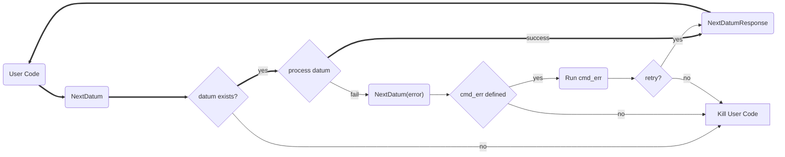

---
# metadata # 
title: Datum Batching
description: Learn how to batch datums to optimize performance.
date: 
# taxonomy #
tags: ["datums", "data-operations"]
series:
seriesPart:
directory: true 
mermaid: true
---

By default, {} processes each datum independently. This means that your user code is called once for each datum. This can be inefficient and costly if you have a large number of small datums or if your user code is slow to start.  

When you have a large number of datums, you can batch them to optimize performance. {} provides a `next datum` command that you can use to batch datums. 

## Flow Diagram





## How to Batch Datums

### Via PachCTL

1. Define your user code and build a docker image. Your user code must call `pachctl next datum` to get the next datum to process.

   
   {}
   {}
   {}
   {}
   {}
   ```s
   transformation() {
     # Your transformation code goes here
     echo "Transformation function executed"
   }

   echo "Starting while loop"
   while true; do
     pachctl next datum
     echo "Next datum called"
     transformation
   done
   ```
   {}
  
   {}

   

2. Create a repo (e.g., `pachctl create repo repoName`).
3. Define a pipeline spec in YAML or JSON that references your Docker image and repo.
4. Add the following to the `transform` section of your pipeline spec:
   - `datum_batching: true`

   ```s
   pipeline:
     name: p_datum_batching_example
   input:
     pfs:
       repo: repoName
       glob: "/*"
   transform:
     datum_batching: true
     image: user/docker-image:tag
   ```
5. Create the pipeline (e.g., `pachctl update pipeline -f pipeline.yaml`).
6. Monitor the pipeline's state either via Console or via `pachctl list pipeline`.

{}

You can view the printed confirmation of "Next datum called" in the logs your pipeline's job. 

{}

### Via Python

1. Define your user code and build a docker image. Your user code can the `@batch_all_datums` convenience decorator to iterate through all datums. This will perform the `NextDatum` calls for you as well as prepare the environment for each datum.

   
   {}
   {}
   {}
   {}
   {}
   ```py
   import os
   from python_pachyderm import batch_all_datums

   @batch_all_datums
   def main():
      # Processing code goes here.
      # This function will be run for each datum until all are processed.
      # Once all datums are processed, the process is terminated.
      print(f'datum processed: {os.environ["PACH_DATUM_ID"]}')

   def init():
      # Initializing code goes here.
      # When this function is called, no input data is present.
      print('Preparing for datum batching job')

   if __name__ == '__main__':
       init()
       print('Starting datum processing')
       main()
   ```
   {}
  
   {}

   

2. Create a repo (e.g., `pachctl create repo repoName`).
3. Define a pipeline spec in YAML or JSON that references your Docker image and repo.
4. Add the following to the `transform` section of your pipeline spec:
   - `datum_batching: true`

   ```s
   pipeline:
     name: p_datum_batching_example
   input:
     pfs:
       repo: repoName
       glob: "/*"
   transform:
     datum_batching: true
     image: user/docker-image:tag
   ```
5. Create the pipeline (e.g., `pachctl update pipeline -f pipeline.yaml`).
6. Monitor the pipeline's state either via Console or via `pachctl list pipeline`.


## FAQ

**Q:** My pipeline started but no files from my input repo are present. Where are they?

**A:** Files from the first datum are mounted following the first call to `NextDatum` or, when using the Python client, when code execution enters the decorated function.
