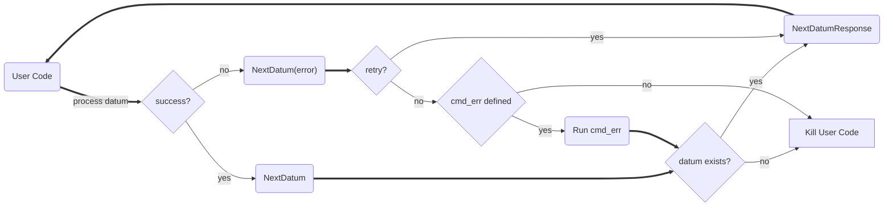

---
# metadata # 
title: Datum Batching
description: Learn how to batch datums to optimize performance.
date: 
# taxonomy #
tags: ["datums", "data-operations"]
series:
seriesPart:
directory: true 
mermaid: true
---

By default, {} processes each datum independently. This means that your user code is called once for each datum. This can be inefficient and costly if you have a large number of small datums or if your user code is slow to start.  

When you have a large number of datums, you can batch them to optimize performance. {} provides a `next` command that you can use to batch datums. 

## Flow Diagram



## How to Batch Datums

### Via PachCTL

1. Define your user code and build a docker image.
2. Create a repo (e.g., `pachctl create repo repoName`).
3. Define a pipeline spec in YAML or JSON that references your Docker image and repo.
4. Add the following to the `transform` section of your pipeline spec:
   - `datum_batching: true`
   - `cmd` should be a bash script that calls `pachctl next datum` and then runs your user code.
   - `stdin` should contain the following:
     - `./pachctl connect grpc://localhost:1650`
     - `while true; do ./pachctl next datum; sleep 10; ls /pfs/repoName -la; done`

```s
pipeline:
  name: p_datum_batching_example
input:
  pfs:
    repo: repoName
    glob: "/*"
transform:
  cmd:
    - bash
  stdin:
    - >-
      ./pachctl connect grpc://localhost:1650
    - >-
      while true; do ./pachctl next datum; sleep 10; ls /pfs/repoName -la; done
  datum_batching: true
  image: user/docker-image:tag
```
5. Create the pipeline (e.g., `pachctl update pipeline -f pipeline.yaml`).
6. Monitor the pipeline's state either via Console or via `pachctl list pipeline`.

