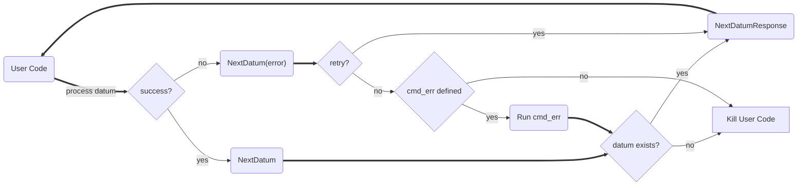

---
# metadata # 
title: Datum Batching
description: Learn how to batch datums to optimize performance.
date: 
# taxonomy #
tags: ["datums", "data-operations"]
series:
seriesPart:
directory: true 
mermaid: true
---

By default, {} processes each datum independently. This means that your user code is called once for each datum. This can be inefficient and costly if you have a large number of small datums or if your user code is slow to start.  

When you have a large number of datums, you can batch them to optimize performance. {} provides a `next` command that you can use to batch datums. 

## Flow Diagram



## How to Batch Datums

### Via PachCTL

1. Define your user code and build a docker image. Your user code must call `pachctl next datum` to get the next datum to process.

   
   {}
   {}
   {}
   {}
   {}
   {}
   {}
   ```s
   import subprocess

   def transformation(): 
       # Your transformation code goes here

   def main():

       print("User code is starting")
       subprocess.run(["pachctl", "connect", "grpc://localhost:1650"])

       print("starting while loop")
       while True:
           subprocess.run(["pachctl", "next", "datum"])
           print("next datum called")

           transformation()

   if __name__ == "__main__":
       main()
   ```
   {}
   {}
   ```s
   package main

   import (
       "os/exec"
   )

   func transformation() {
       // Your transformation code goes here
   }

   func main() {
       cmd := exec.Command("pachctl", "connect", "grpc://localhost:1650")
       cmd.Run()

       for {
           cmd := exec.Command("pachctl", "next", "datum")
           cmd.Run()
           transformation()
       }
   }

   ```
   {}
   {}
   ```s
   const { exec } = require('child_process');

   function transformation() {
       // Your transformation code goes here
   }

   function main() {
       console.log("User code is starting");
       exec('pachctl connect grpc://localhost:1650', (error, stdout, stderr) => {
           if (error) {
               console.error(`Error connecting to Pachyderm: ${error}`);
               return;
           }
           console.log('Connected to Pachyderm');
       });

       console.log("Starting while loop");
       while (true) {
           exec('pachctl next datum', (error, stdout, stderr) => {
               if (error) {
                   console.error(`Error running pachctl next: ${error}`);
                   return;
               }
               console.log('Next datum called');
               transformation();
           });
       }
   }

   if (require.main === module) {
       main();
   }

   ```
   {}
   {}

   

2. Create a repo (e.g., `pachctl create repo repoName`).
3. Define a pipeline spec in YAML or JSON that references your Docker image and repo.
4. Add the following to the `transform` section of your pipeline spec:
   - `datum_batching: true`

   ```s
   pipeline:
     name: p_datum_batching_example
   input:
     pfs:
       repo: repoName
       glob: "/*"
   transform:
     datum_batching: true
     image: user/docker-image:tag
   ```
5. Create the pipeline (e.g., `pachctl update pipeline -f pipeline.yaml`).
6. Monitor the pipeline's state either via Console or via `pachctl list pipeline`.

{}

You can view the printed confirmation of "Next datum called" in the logs your pipeline's job. 

{}